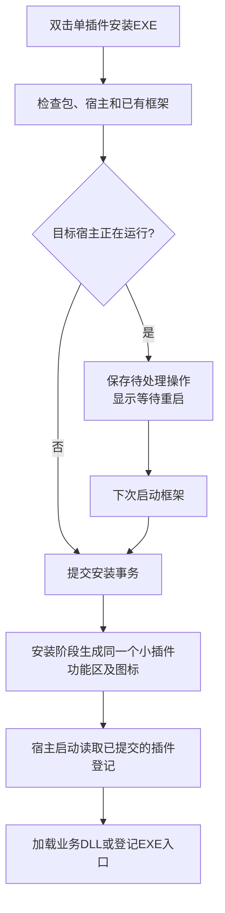

# 一份工具箱，各自独立的插件

用户双击任意一个插件的安装EXE。安装器检查包和目标宿主，首次建立共用框架，后续将新插件登记到已有框架。用户打开2027后，在“小插件”功能区看到全部已安装插件，并从同一处进入管理器。

技能负责指导开发，模板提供可运行起点，打包器把实现变成标准包，框架负责安装状态和按钮。业务插件只负责自己的功能。仅统一文件命名不能实现自动接入，框架与包契约必须一致。

清单格式见[包契约](package-contract.md)，代码边界见[宿主约束](../skills/zw3d-plugin-dev/references/host-boundaries.md)，验收见[实际验证方法](../skills/zw3d-plugin-dev/references/acceptance.md)。

## 安装与启动

启动顺序是契约的一部分：先提交有效的待处理操作，再加载业务DLL。不能先加载旧DLL，再覆盖对应文件。正在加载的框架自身更新需要单独处理；不能借助业务插件的待处理逻辑直接覆盖已加载框架。

每次启动都与管理器握手：先取得与安装器相同的锁，恢复未完成事务，再应用待处理操作。没有待处理记录也不能跳过这一步，因为立即安装可能被中断。管理器超时或失败时，该会话停止加载业务插件，保留管理入口和启动日志；不能在管理器仍可能写文件时继续加载。只有需要恢复或提交变更的普通权限会话才请求提权。

## 版本与共存

`id`决定这是不是同一个插件；`version`决定这是哪个版本。框架管理活动版本和待处理请求，插件作者不自行删除旧目录。重复安装不能重复按钮；不同插件的稳定身份和命令前缀不能冲突。框架降级、插件降级和不兼容的契约应被明确拒绝或通过已验证的流程处理。

“安装到同一个项目”指加入同一个工具箱管理体系。每个插件仍有独立目录、版本和数据，其他作者无需修改工具箱源码，也不必重新生成八个工具的总安装包。

## 卸载

管理器为每个插件提供普通卸载和彻底清理。普通卸载删除该插件程序、登记和按钮，保留个人设置与日志；彻底清理额外删除该插件登记的数据。其他插件与共用框架保留。宿主运行时，操作记录为待处理并在下次启动生效。

清理依据安装记录和确定的数据目录，不根据显示名称搜索文件，也不删除用户选定的图纸目录。

## 发布与证据

独立项目包含技能、框架源码、模板、示例、打包器和测试。SDK不进入仓库。发布前使用本项目的测试与真实宿主证据更新验证报告；架构文档描述目标行为，不等同于“该行为已经通过测试”。

从这个仓库单独安装技能时，发布包应附带它调用的实际工具和模板。源码模式可以使用仓库目录；仅复制`SKILL.md`不足以获得一键安装和框架能力。

## 持续演进

0.2.0框架使用独立版本和兼容协议1。插件版本冻结完整清单及有效载荷，主机API检查可以随框架变化；旧安装器复用兼容的新框架而不覆盖降级。框架升级独立暂存，等待宿主关闭后由外部程序持锁提交，再提交插件变更。旧工具箱首次迁移需要关闭宿主。管理读取隔离坏登记，修改状态仍严格校验；目录选择变化使旧列表立即失效。
